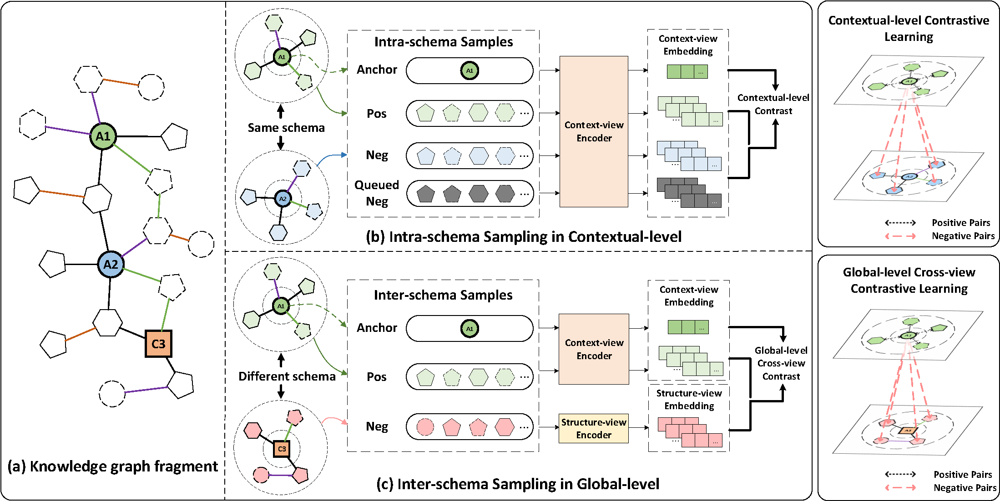

<h1 align="center">
    SMiLE
</h1>
<h3 align="center">
    Schema-augmented Multi-level Contrastive Learning for Knowledge Graph Link Prediction
</h3>

Official code repository :bookmark_tabs: for _EMNLP 2022 Findings_ paper "[SMiLE: Schema-augmented Multi-level Contrastive Learning for Knowledge Graph Link Prediction](https://arxiv.org/abs/2210.04870)".



In this paper, we identify that most existing embedding-based methods fail to capture contextual information in entity neighborhoods. Additionally, little attention is paid to the diversity of entity representations in different contexts.
We consider that the schema of KG is beneficial for preserving the consistency of entities across contexts, and we propose a novel **s**chema-augmented **m**ult**i**-level contrastive **le**arning framework (**SMiLE**:blush:) to conduct knowledge graph link prediction.

## Dependencies
Environmental Settings: Linux Ubuntu 18.04.6 LTS, CUDA 10.2, NVIDIA TITAN RTX(24GB).

Run `pip install -r requirements.txt` to install following dependencies:

- Python 3.6.5
- numpy 1.19.5
- pandas 1.1.0
- networkx 2.4
- scikit_learn 1.1.2
- torch 1.5.0

## Datasets
We use four public KG datasets: FB15k, FB15k-237, JF17k and HumanWiki.

FB15k, JF17k and HumanWiki data are taken from [RETA](https://github.com/eXascaleInfolab/RETA_code). FB15k-237 data came from [CompGCN](https://github.com/malllabiisc/CompGCN).

The datasets used in this repository are list in the directory `$REPO_DIR/data`, you can directly use them or download corresponding datasets from links above.

## How to run

### 1. Pretrained node embeddings
Download pretrained node embeddings from [here](https://drive.google.com/drive/folders/1BIdgEKeBd-uRwXwF4IULQ_5z4ctNeLKi?usp=sharing), and put them into corresponding dataset directory.

PS: For a new dataset, you can generate the pretrained embeddings by employing [Node2vec](https://github.com/aditya-grover/node2vec) or [CompGCN](https://github.com/malllabiisc/CompGCN).

### 2. Construct schema graph
Before starting training on each dataset, schema graph are essential to be generated first.

Run `$REPO_DIR/src/build_schema.py` file with following command:
```shell
# Build schema graph for $dataset with a frequency threshold of $topNfilters
python build_schema.py --data_path '/data/$dataset' --topNfilters $topNfilters
```
The generated schema file `schema_ttv-$topNfilters.txt` will be added to corresponding dataset directory.

### 3. Model training and evaluation

The following command lists the key parameters to run SMiLE on a dataset (Taking dataset FB15k as an example):
```shell
# Taking dataset FB15k as an example
python main.py \
    --gpu_id 0 \
    --data_name 'FB15k' \
    --data_path 'data' \
    --outdir 'output/FB15k-1' \
    --pretrained_embeddings 'data/FB15k/FB15k.emd' \
    --n_epochs 15 \
    --batch_size 1024 \
    --checkpoint 4 \
    --schema_weight 1\
    --n_layers 4 \
    --n_heads 4 \
    --gcn_option 'no_gcn' \
    --node_edge_composition_func 'mult' \
    --ft_input_option 'last4_cat' \
    --path_option 'shortest' \
    --ft_n_epochs 15 \
    --num_walks_per_node 1 \
    --max_length 6 \
    --beam_width 6 \
    --walk_type 'bfs' \
    --topNfilters -700 \
    --is_pre_trained \
    --use_schema
```

To reproduce the results of SMiLE on FB15k, FB15k-237, JF17k and HumanWiki, please execute following steps:
1. Choose a dataset $dataset.
2. Copy parameters and commands in file `$REPO_DIR/config/$dataset/run_$dataset.sh` and paste them to file `$REPO_DIR/run.sh`
3. Execute command `sh run.sh`.

The trained model checkpoints and output files are saved in directory `$REPO_DIR/output`.

## Acknowledgement
Some codes are modified from [SLiCE](https://github.com/pnnl/SLICE) and [RETA](https://github.com/eXascaleInfolab/RETA_code). Thanks a lot to the authors!