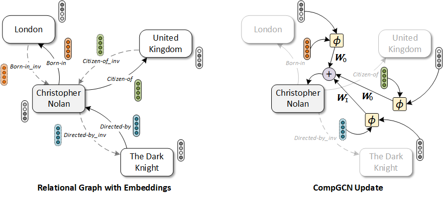

## Composition-Based Multi-Relational Graph Convolutional Networks

[](https://iclr.cc/) [](https://arxiv.org/abs/1911.03082) 

Source code for [ICLR 2020](https://iclr.cc/) paper: [**Composition-Based Multi-Relational Graph Convolutional Networks**](https://openreview.net/forum?id=BylA_C4tPr)



**Overview of CompGCN:** *Given node and relation embeddings, CompGCN performs a composition operation φ(·) over each edge in the neighborhood of a central node (e.g. Christopher Nolan above). The composed embeddings are then convolved with specific filters WO and WI for original and inverse relations respectively. We omit self-loop in the diagram for clarity. The message from all the neighbors are then aggregated to get an updated embedding of the central node. Also, the relation embeddings are transformed using a separate weight matrix. Please refer to the paper for details.*

### Dependencies

- Compatible with PyTorch 1.0 and Python 3.x.
- Dependencies can be installed using `requirements.txt`.

### Dataset:

- We use FB15k-237 and WN18RR dataset for knowledge graph link prediction. 
- FB15k-237 and WN18RR are included in the `data` directory. The provided code is only for link prediction task

### Training model (Link Prediction):

- Install all the requirements from `requirements.txt.`

- Execute `sh preprocess.sh` for extracting the dataset.

- To start training run:

  ```shell
  python run.py -name test_run -model compgcn -score_func conve -opn corr -gpu 0 -data FB15k-237
  ```

  - `-score_func` denotes the link prediction score score function 
  - `-opn` is the composition operation used in **CompGCN**. It can take the following values:
    - `sub` for subtraction operation:  Φ(e_s, e_r) = e_s - e_r
    - `mult` for multiplication operation:  Φ(e_s, e_r) = e_s * e_r
    - `corr` for circular-correlation: Φ(e_s, e_r) = e_s ★ e_r
  - `-name` is some name given for the run (used for storing model parameters)
  - `-model` is name of the model `compgcn'.
  - `-gpu` for specifying the GPU to use
  - Rest of the arguments can be listed using `python run.py -h`
### Citation:
Please cite the following paper if you use this code in your work.
```bibtex
@inproceedings{
    vashishth2020compositionbased,
    title={Composition-based Multi-Relational Graph Convolutional Networks},
    author={Shikhar Vashishth and Soumya Sanyal and Vikram Nitin and Partha Talukdar},
    booktitle={International Conference on Learning Representations},
    year={2020},
    url={https://openreview.net/forum?id=BylA_C4tPr}
}
```
For any clarification, comments, or suggestions please create an issue or contact [Shikhar](http://shikhar-vashishth.github.io).
